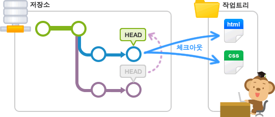

## VCS
> Version Control System
- 동일한 정보에 대한 여러 버전을 관리하는 것
- 소프트웨어 개발에서 팀 단위로 개발 중인 소스 코드나, 문서를 관리하는데 사용
- v1.0.0.zip, v1.0.1.zip과 같은 압축파일 형태로 공유하지 않기 위함

## Git
Linux 프로젝트 중 버전관리 소프트웨어의 내부 개발이 필요하다 판단되어 만들어졌습니다.  
초기 개발자는 Linux의 개발자인 리누스 토발즈입니다. Git은 다음과 같은 목표로 개발되었습니다.
- 빠른 속도
- 단순한 구조
- 비선형적인 개발(수천 개의 동시 다발적인 브랜치)
- 완벽한 분산(DVCS)
- Linux 커널 같은 대형 프로젝트에도 유용할 것(속도나 데이터 크기 면에서)

비선형적인 개발을 위해 브랜치 시스템을 도입했고, 원격저장소와 로컬을 분리함으로써 여러 개발자가 분산작업을 원활하게 할 수 있게 고안되었습니다.

또한, 모든 커밋에 대해 Checksum(Hash)을 만들어 데이터 무결성을 보장합니다.(SHA-1)

## Inside of Git
1. Git은 기본적으로 파일 시스템의 스냅샷을 저장합니다.(커밋 당시의 Git 디렉토리의 모든 파일 정보를 저장)
2. 또한 파일 및 스냅샷을 해시하여 빠르게 바뀐 버전인지, 아닌지를 체크합니다.
3. 이후 스냅샷들의 크기가 커지면 주기적으로 git gc(garbage collection)를 통해 delta를 만듭니다.

## Git 명령어
### 기초적인 명령어 사용
- git init : Git 디렉토리를 시작합시다.
- git add * : Git으로 관리할 파일을 골라봅시다.
- git commit -m "메세지" : 메세지와 함께 디렉토리의 상태를 저장합시다.
- git push : 원격 저장소에 커밋 내용을 보내봅시다.

### 조금 더 잘 알고 있다면
- git checkout : 브랜치의 상태로 디렉토리를 변경합니다.
- git brach {name} : 새로운 브랜치를 만듭니다.
- git reset --hard HEAD : 마지막 커밋으로 모든 것을 되돌립니다.
- git merge {branch-name} : 현재 체크아웃된 브랜치를 기준으로 name을 머지합니다.

### File Status Lifecycle

- git status : 파일들의 상태를 확인할 수 있습니다.
- git status -s : 간단하게 보기 옵션 사용
- git add {filename} : untracked 파일을 staged로 만들거나, modified 파일을 staged로 만들 수 있습니다.
- git add * : 많이 쓰이지만, 충분히 안전할 때 사용합니다.
- git diff : staged 상태와 unstaged(modified) 상태의 차이를 보여줍니다.
- git diff --staged(또는 git diff --cached) : staged와 commited 상태를 비교합니다.
- git diff --name-only HEAD~1 : 리비전끼리 HEAD로 변경된 파일만 확인할 수 있습니다.
- git commit -m "커밋메세지" : staged 상태의 파일을 기록합니다.
- git commit -a : modified(delete 포함)를 staged로 만든 후 커밋할 수도 있습니다.
- git rm {파일} : 실제 디렉토리에서 파일을 삭제하고, unstaged가 됩니다.
- git rm --cached : 실제 디렉토리에서 삭제하지 않고 git 내에서만 삭제할 수도 있습니다.

### gitignore
Git이 몇몇 파일(자동 생성 파일 등)을 무시하게끔 하고 싶으면 .gitignore을 수동으로 만듭니다.  
.gitignore는 쉘 등에서 사용하는 glob 패턴을 따릅니다.  
git clean -df 등의 명령어도 ignore 안의 파일은 무시하게 됩니다.

- *.a : 확장자가 .a인 파일 무시
- !lib.a : 위에서 확장자가 .a인 파일은 무시하게 했지만 lib.a는 무시하지 않음
- /TODO : 현재 디렉토리에 있는 TODO 파일은 무시하고 subdir/TODO처럼 하위 디렉토리에 있는 파일은 무시하지 않음
- build/ : build/ 디렉토리에 있는 모든 파일은 무시
- doc/*.txt : doc/notes.txt 파일은 무시하고 doc/server/arch.txt 파일은 무시하지 않음
- doc/**/*.pdf : doc 디렉토리 아래의 모든 .pdf 파일을 무시

### log
git에서 커밋 히스토리를 조회하기 위해 사용하는 방법입니다.
- git log : 기본적인 조회
- git log --online : 깔끔하게 보기
- git log -p : 각 커밋의 diff와 함께 보기
- git log --stat : 각 커밋의 통계 정보와 보기 (변경된 파일 수, insertion/deletion line 수)
- git log --graph : 브랜치와 머지 히스토리까지 그래프 모양으로 보여줍니다.
- git config --global alias.lg "log --color --graph --pretty=format:'%Cred%h%Creset -%C(yellow)%d%Creset %s %Cgreen(%cr) %C(bold blue)<%an>%Creset' --abbrev-commit"
 : 터미널에 입력하여 global alias 등록하고 git lg 명령어로 git log --graph했을 때보다 직관적이고 하이라이팅된 형태로 확인

Author : 실제로 커밋을 한 사람  
Commiter : 커밋을 Git repo에 저장한 사람(pull request merge의 경우 GitHub라고 보입니다.)

### config
Git은 지역(local), 전역(global), 시스템(system) 이렇게 크게 3가지 범위로 설정이 가능한데요.

지역 범위로 설정하면 특정 저장소(repository)로 한정되고, 전역 범위는 현재 사용자(user)의 모든 저장소를 포함시킵니다. 자주 사용되지는 않지만 시스템 범위로 설정하면 해당 컴퓨터의 모든 저장소와 사용자를 걸쳐서 적용됩니다.

이렇게 설정된 정보는 컴퓨터 내에서 서로 다른 위치에 텍스트 파일의 형태로 관리가 되는데요. 지역 범위의 설정 정보는 저장소 폴더의 .git/config에 저장되며, 전역 범위의 설정값은 운영체제의 사용자 폴더의 .gitconfig에 저장됩니다. 시스템 범위의 설정값은 운영체제에 따라 다른데 유닉스 계열에서는 /etc/gitconfig, 윈도우즈 계열에서는 C:\ProgramData\Git\config에 저장됩니다.

간단하게 글로벌 옵션으로 사용자명 등록하기
- git config --global user.name "user"
- git config --global user.email "user@email.com"

### alias
- git config --global alias.ci commit : git ci가 git commit을 함.
- git config --global alias.graph 'log --graph' : git graph가 git log --graph를 함.(명령어가 플래그아 함께 있는 경우 single quote를 사용)

### branch
Git 에서는 항상 작업할 브랜치를 미리 선택해야 합니다.  
처음에 Git을 설치하게 되면 'master' 브랜치가 선택되어 있죠.  
현재 선택된 브랜치가 아닌 다른 브랜치에서 작업하고 싶을 때에는, '체크아웃(checkout)' 명령어를 실행하여 원하는 브랜치로 전환할 수 있습니다.  
체크아웃을 실행하면, 우선 브랜치 안에 있는 마지막 커밋 내용이 작업 트리에 펼쳐집니다.  
브랜치가 전환 되었으므로 이 후에 실행한 커밋은 전환한 브랜치에 추가됩니다.

### HEAD
'HEAD' 란 현재 사용 중인 브랜치의 선두 부분을 나타내는 이름입니다.  
기본적으로는 'master'의 선두 부분을 나타냅니다.  
'HEAD' 를 이동하면, 사용하는 브랜치가 변경됩니다.  
  
커밋을 지정할 때, '\~(틸드, 물결기호)'와 '^(캐럿, 삽입기호)'을 사용하여 현재 커밋으로부터 특정 커밋의 위치를 가리킬 수 있습니다.  
이 때 자주 사용하는 것이 'HEAD' 로서, '\~(틸드)'와 숫자를 'HEAD' 뒤에 붙여 몇 세대 앞의 커밋을 가리킬 수 있습니다.  
'^(캐럿)'은, 브랜치 병합에서 원본이 여럿 있는 경우 몇 번째 원본인지를 지정할 수 있습니다.

### reset
staging area와 working directory의 상태를 원래대로 되돌려봅시다.
- git reset --mixed : default, HEAD를 옮기고, staging area를 비우며 working directory는 유지
- git reset --soft : HEAD를 옮기고, staging area와 working directory는 유지
- git reset --hard : HEAD를 옮기고, staging area를 비우고 working directory도 해당 스냅샷으로 되돌림

HEAD 등을 기준으로 사용할 수도 있고, branch 이름을 주어 branch의 마지막 커밋으로 HEAD를 바꿀 수도 있습니다. branch는 변하지 않습니다.

### checkout
reset과 비슷하다고 생각할 수 있지만 branch를 옮길 때 자주 사용됩니다.  
- git checkout {branch} : HEAD를 branch의 HEAD로 옮깁니다. branch도 변경됩니다.

### revert
commit --amend와 rebase -i, reset 등등은 커밋 자체를 수정합니다.  
따라서 push한 커밋에 대해 수정하는 것은 공동 작업자들을 힘들게 합니다.  
따라서 push한 사항을 바꾸고 싶다면 revert를 사용합시다.  
git revert {SHA}를 해주면 해당 커밋을 삭제하는 커밋을 추가할 수 있습니다.  
이렇게 되면 새로운 커밋이 붙기 때문에 문제가 덜합니다.

### branch
- git branch {name} : name branch 생성
- git checkout -b {name} : name branch 생성하고, 이 곳으로 checkout
- git branch -d {name} : name branch 삭제
- git branch -a : remote, local branch 모두 보기
- git push --delete {remote name} {branch} : remote에서  branch tkrwp
- git branch --contains {SHA} : 이 커밋이 포함된 branch 찾기

#### branch의 구분
- 메인터넌스 브랜치(maintenance branch)
- 개발 브랜치(development branch)
- 주제 브랜치(topic branch: feature/hotfix)
- 그 외 integration test 및 experimental test용 브랜치
  
그냥 팀에 맞게 잘 하는게 중요하다. (그래도 기본 3개 있으면 좋다.)
- master : 최신, 릴리즈 및 버전은 여기에서 나간다. stable 브랜치라고도 한다.
- dev : 개발 최신 브랜치. 개발자 개인의 테스트나 단위 테스트 정도만 된 곳.  
deb branch는 보통 코드 리뷰는 되고 통합 테스트는 안될 수 도 있는 곳
- topic : 각자 작업자들의 작업용 브랜치. feature branch와 hotfix 브랜치로 나눠서 부르기도 한다.

### remote repo / push
git은 원격 저장소를 여러 개 둘 수 있습니다.
- git remote add {remote name} {url} : url에 remote name을 지정하여 remote repo 저장
- git remote -v : 모든 remote repo qhrl
- git remote set-url {remote name} {url} : remote repo의 url 변경
remote-name / branch-name으로 remote repo와 branch 이름을 확인할 수 있습니다.  
  
push 명령으로 원하는 remote repo의 브랜치에 상태를 올리거나, 태그를 올리거나 할 수 있습니다.

### tracking branch (upstream)
로컬 브랜치와 원격 브랜치를 연결해두면 push 시에 편합니다. (git push로 바로 가능)
- git branch -vv : 브랜치와 이에 해당하는 tracking brach를 확인해봅니다.
- git push -u {remote name} {branch} : 현재 브랜치를 push하면서 remote의 브랜치를 트랙킹하게 합니다.
- git branch -u {remote name}/{branch} : 현재 브랜치가 remote의 브랜치를 트랙킹하게 합니다.

### fetch
원격 브랜치의 정보를 가져오고 FETCH_HEAD가 생성됩니다.  
이를 이용해 checkout 등이 가능합니다.

### pull
pull은 fetch 후 merge까지 같이 해줍니다.  
  
#### Git pull과 fetch의 차이
  
본격적인 이야기에 앞서 '클론'이란 무엇일까요?  
클론 저장소(clone repository)는 원격 저장소를 복제한 저장소입니다.  
이는 다른 사람의 소스 코드 복사본을 생성하는 것과 같으며, 개발을 할 때 보통 우리는 클론 저장소에서 작업을 진행하게 됩니다.  
  
이러한 상황에서 만일 원격 저장소에 변경 사항이 생겼다면, 그 내용을 가져와 클론 저장소를 최신 상태로 유지해주어야 합니다.  
  
바로 여기서 fetch와 pull이 등장합니다.  
  
git fetch는 로컬 Git에게 원격 저장소에서 최신 메타데이터 정보를 확인하라는 명령을 전달합니다.  
단 fetch는 원격 저장소에 변경사항이 있는지 확인만 하고, 변경된 데이터를 로컬 Git에 실제로 가져오지는 않습니다.  
  
반면 git pull은 원격 저장소에서 변경된 메타데이터 정보를 확인할 뿐만 아니라 최신 데이터를 복사하여 로컬 Git에 가져옵니다.

### merge
branch를 합칩니다. fast-forward merge, 3 way merge 종류가 있습니다.  
  
#### dealing with confict situation
auto-merge가 안 되는 경우는 한 번에 같은 부분을 수정했기 때문입니다.  
이 때 git status를 하면 unmerged path에서 확인됩니다. (both modified)  
  
=======를 기준으로 위로 현재 브랜치의 내용이 표시되고, 아래에는 머지하려는 브랜치의 내용이 표시됩니다.  
원하는 코드를 남겨두고 <<<<<<<과 =======를 지워주면 충돌 해결입니다.  
unmerged path의 파일을 다시 add한 뒤 git commit하면 merge가 완료됩니다.

### pull request
git 자체로는 git request-pull을 이용하여 관리자에게 직접 해당 리퀘스트를 검토 후 merge하게 합니다.  
대부분의 git 호스팅 사이트에서는 pull request 버튼으로 이를 쉽게 이용할 수 있습니다.  
  
오픈소스 라이브러리에 기여하는 시작점입니다.  
오픈소스를 먼저 clone한 후, 자신의 branch를 따고, pull request를 통해 원래 브랜치에 자신의 브랜치를 merge 해달라는 요청을 할 수 있습니다.  

PR을 날리기 전에 issue 등을 확인하여 작업 중인 사람이 있는 지를 확인하거나, 자신이 이런 작업을 할 것이라고 올려주는 것이 좋습니다.  

간단하게 번역 수정부터 시작해보세요. 오픈소스에 기여하는 가장 빠르고 쉬운 방법 중 하나입니다.

### blame
각각 파일의 마지막 commiter를 보여줍니다.
- git blame {파일} : 파일의 모든 행의 마지막 수정자를 보여줍니다.
- git blame -e {파일} : 파일의 수정자의 이메일을 위주로 보여줍니다.
- git blame -L {startline},{endline} {파일} : 특정 라인부터 특정 라인까지 보여줍니다.